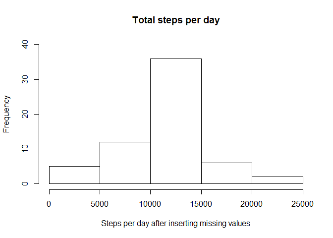

```r
#setting working directory
setwd("D:/_JHU_DSC/Course 05 - Reproducible Research/week2/RepData_PeerAssessment1")
```


```r
#Unzip file
unzip("./activity.zip", exdir="./data")
```

## Loading and preprocessing the data

```r
#read csv file
activity <- read.table("./data/activity.csv", sep=",", header = TRUE)
#Converting column date to a date format
library(dplyr)
```

```
## 
## Attaching package: 'dplyr'
```

```
## The following objects are masked from 'package:stats':
## 
##     filter, lag
```

```
## The following objects are masked from 'package:base':
## 
##     intersect, setdiff, setequal, union
```

```r
#transform column date in a date type
activity<-mutate(activity,date=as.Date(date, format = "%Y-%m-%d"))
```


## What is mean total number of steps taken per day?

```r
#sum the steps per day and get the mean and meadian
sumVector<-tapply(activity$steps, activity$date, FUN=sum)
meanSteps<-round(mean(sumVector, na.rm=T))
medianSteps<-median(sumVector, na.rm=T)
#make a histogram of total steps per day
hist(sumVector,main="Total steps per day", xlab="Steps per day",ylim=c(0,30))
```

<!-- -->

**The mean is: 10766   
The median is 10765 **

## What is the average daily activity pattern?

```r
#Create a dataset grouped by interval, with mean of steps, for all days
stepsInterval<-activity %>% group_by(interval) %>% summarize(mean_steps=mean(steps,na.rm=TRUE))
#make a time series plot with the avarage steps across all days
plot(stepsInterval,type="l",xlab="Time Intervals - 5-minute interval",ylab="Mean of steps",main="Mean of steps taken per 5 minute interval")
```

<!-- -->

```r
#Filter the interval with max number of steps on avarage
MaxSteps <- stepsInterval %>% filter(mean_steps==max(stepsInterval$mean_steps))
```
**The interval with max number of steps on avarege is: 835**

## Imputing missing values

```r
#calculate missing values
missingValues<-sum(is.na(activity$steps))
```
**There are 2304 missing values on the dataset**


```r
#Variable to check if the number of updates are equal to number of missing values
QtyOfUpdates<-0
#create a new dataset equal to the original to insert missing values
activityWithUpdates<-activity
#fill dataset null values, with mean of the interval for all days
#a loop on all rows of the dataset
for (i in 1:nrow(activityWithUpdates))
{
        #check if the data is null, if yes update the steps with the mean of steps, for all days from stepsinterval dataset
        if (is.na(activityWithUpdates[i,"steps"]))
        {
                activityWithUpdates[i,"steps"]<- (stepsInterval %>% filter(interval==activityWithUpdates[i,"interval"]))[2]
                QtyOfUpdates<-QtyOfUpdates+1
        }
}
```
**There are 2304 values updated on the dataset**


```r
#sum the steps per day, and get the mean and meadian after inserting missing values
sumVectorWithUpdates<-tapply(activityWithUpdates$steps, activityWithUpdates$date, FUN=sum)
meanSteps<-round(mean(sumVectorWithUpdates))
medianSteps<-round(median(sumVectorWithUpdates))
#make a histogram of total steps per day
hist(sumVectorWithUpdates,main="Total steps per day", xlab="Steps per day after inserting missing values",ylim=c(0,40))
```

<!-- -->

**The mean is: 10766   
The median is 10766 **

The median moved a little bit (1 step), going close to the mean. The  mean value did not change.

## Are there differences in activity patterns between weekdays and weekends?

```r
#library to use is.weekend function
library(chron)
#create a column with a factor of type of the day.
activityWithUpdates <- activityWithUpdates %>% mutate(typeofday=factor(ifelse(is.weekend(date) == TRUE, "weekend", "weekday")))

#library for the plot
library(ggplot2)
```

```
## Registered S3 methods overwritten by 'ggplot2':
##   method         from 
##   [.quosures     rlang
##   c.quosures     rlang
##   print.quosures rlang
```

```r
#summarise grouping by tyofday, and getting mean of steps
sumVector<-summarise(group_by(activityWithUpdates,typeofday,interval),steps=mean(steps))
#plot the graph
ggplot(sumVector, aes(x = interval, y = steps)) + 
        ggtitle("Mean of steps taken per 5 minute interval across all weekday days or weekend days") +
        xlab("Interval") +
        ylab("Steps") +
        facet_wrap(~typeofday,ncol=1)+
        geom_line()
```

<!-- -->

Yes there are some differences. The avarege steps in the weekend are higher between intervals 1000 and 1750. Another factor is that the max number of avarege steps is higher on the weekdays. 
